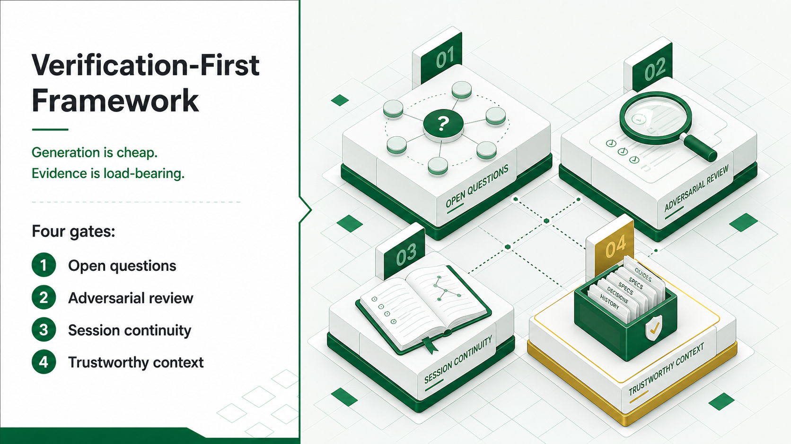
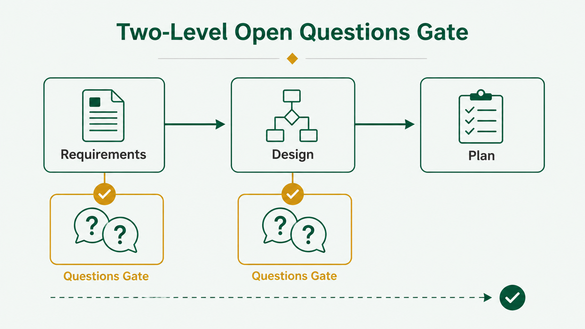
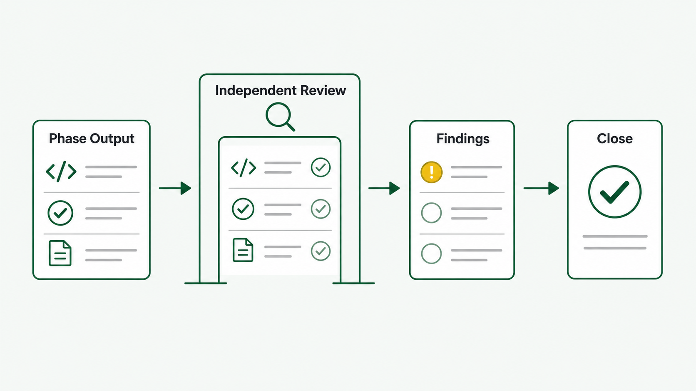
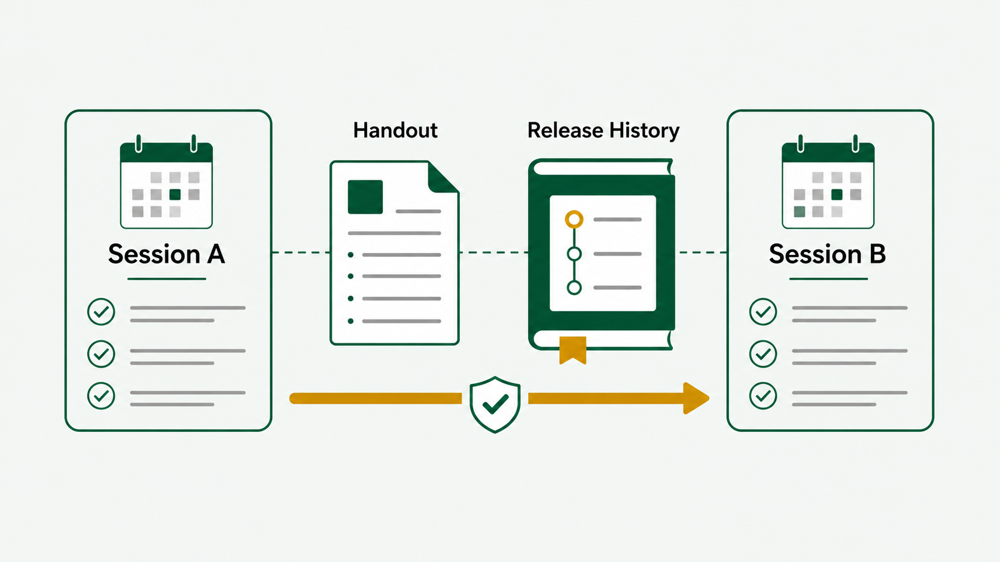
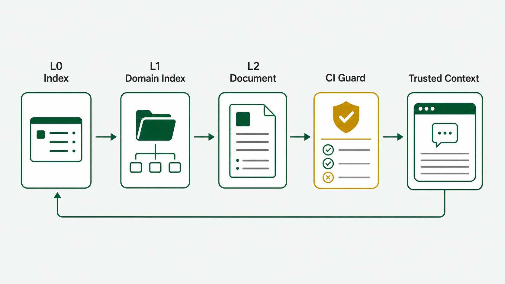

# Tessallite Pattern Framework Kit



This repository contains a practical framework kit derived from
[`tessallite-pattern.md`](tessallite-pattern.md).

The original article explains why many LLM coding frameworks fail at scale:
they optimize generation while under-investing in verification. This kit turns
that argument into reusable materials, artefacts, templates, prompts,
checklists, examples, illustrations, and a lightweight documentation governance
script.

The article is the field report. This repository is the operating kit.

## What This Kit Is For

Use the Tessallite Pattern when an AI-assisted software project has moved
beyond toy generation and needs durable delivery discipline:

- features span many files or modules
- specs can drift from implementation
- sessions continue across days or weeks
- documentation is part of the working context
- LLM output must be audited before it is trusted
- the architect must preserve decisions, surprises, and trade-offs

The pattern is intentionally heavier than casual AI coding. It is designed for
systems where wrong assumptions compound.

## Why It Exists

Most LLM coding workflows make generation easier. That is useful, but it is not
where serious projects usually fail.

The failure usually appears later:

- a requirements gap becomes a schema guess
- a spec drifts during implementation
- an agent reviews its own work too generously
- session context disappears between days
- stale documentation is retrieved as if it were current truth

The Tessallite Pattern treats those as structural failures. It adds gates at the
points where LLM-assisted work most often becomes unverifiable.

## Start Here

1. Read the framework index:
   [`docs/tessallite-pattern/_INDEX.md`](docs/tessallite-pattern/_INDEX.md)
2. Read the handbook:
   [`docs/tessallite-pattern/framework-handbook.md`](docs/tessallite-pattern/framework-handbook.md)
3. Use the lifecycle guide for real delivery:
   [`docs/tessallite-pattern/lifecycle-guide.md`](docs/tessallite-pattern/lifecycle-guide.md)
4. Copy the templates you need from:
   [`docs/tessallite-pattern/templates/`](docs/tessallite-pattern/templates/)
5. Run the documentation index guard when you adopt the tiered docs structure:
   `bash scripts/check-docs-index.sh`

## Core Idea

The Tessallite Pattern says that the bottleneck in LLM coding is verification,
not generation.

The four load-bearing elements are:

1. Two-level open-questions gate
2. Mandatory adversarial review at every phase boundary
3. Session continuity infrastructure
4. Tiered documentation governance with CI enforcement

Everything in this kit supports those four elements.

## The Four Structural Elements

### 1. Two-Level Open-Questions Gate



The model is forced to state what it does not know twice:

- once after high-level requirements
- again after detailed design exposes schemas, APIs, validation rules, and edge
  cases

Planning is blocked until required questions are answered, deferred, or the
scope is narrowed.

### 2. Mandatory Adversarial Review



Every non-trivial phase is reviewed by an independent context before it closes.
The auditor looks for spec drift, unwired code, incomplete stubs, weak tests,
missing documentation, and hidden assumptions.

The phase closes only after findings are fixed, accepted, or logged.

### 3. Session Continuity Infrastructure



The model has no durable memory. The project creates it.

Each meaningful session ends with a handout. Significant work also updates a
release history journal so future sessions recover not only what changed, but
why the course changed.

### 4. Tiered Documentation Governance



Documentation is treated as a working context cache:

- L0: `docs/_INDEX.md`
- L1: `docs/<domain>/_INDEX.md`
- L2: `docs/<domain>/<domain>_<name>.md`

The CI guard checks that active docs are indexed. The goal is trustworthy
context: future LLM sessions should retrieve current, routed, reviewed
documentation rather than stale assumptions.

## Lifecycle

The full lifecycle has six stages:

1. High-level requirements conversation
2. First open-questions pass
3. Design specification and second open-questions pass
4. Implementation planning
5. Phase delivery with adversarial review
6. Session close and continuity update

Small fixes can use a lightweight path. Large subsystems should use the full
set of gates.

## Visual Assets

This repository includes Tessallite-branded illustrations under
[`illustrations/`](illustrations/).

- [`illustrations/generated-text/`](illustrations/generated-text/): broader
  slide-style illustrations with generated text embedded in the image
- [`illustrations/structural-elements-simple/`](illustrations/structural-elements-simple/):
  simple flat illustrations for the four structural elements
- [`illustrations/BRAND_BRIEF.md`](illustrations/BRAND_BRIEF.md): palette and
  style rules used for the artwork

## Contents

- `framework-handbook.md`: the full operating model
- `lifecycle-guide.md`: end-to-end feature workflow
- `adoption-roadmap.md`: how to introduce the pattern gradually
- `governance-model.md`: ownership, gates, artefact rules, and failure modes
- `comparison.md`: why this pattern differs from generation-first frameworks
- `origin.md`: how the pattern emerged from concrete project failures
- `templates/`: fill-in artefacts for each stage
- `checklists/`: practical gates and maturity scorecards
- `prompts/`: reusable prompts for LLM-assisted work
- `examples/`: worked example of a feature moving through the pattern
- `training/`: workshop material and exercises
- `illustrations/`: brand-aligned visuals for docs, slides, and articles
- `scripts/check-docs-index.sh`: lightweight index consistency guard

## Repository Map

| Path | Purpose |
| --- | --- |
| [`tessallite-pattern.md`](tessallite-pattern.md) | Source article and field report. |
| [`docs/_INDEX.md`](docs/_INDEX.md) | L0 documentation router. |
| [`docs/tessallite-pattern/`](docs/tessallite-pattern/) | Framework handbook, lifecycle, governance, adoption, templates, prompts, examples, and training. |
| [`illustrations/`](illustrations/) | Tessallite-branded visual assets. |
| [`scripts/check-docs-index.sh`](scripts/check-docs-index.sh) | Documentation index consistency guard. |

## Use It On A Project

For a non-trivial feature:

1. Draft requirements with
   [`requirements-template.md`](docs/tessallite-pattern/templates/requirements-template.md).
2. Run the first open-questions pass with
   [`open-questions-template.md`](docs/tessallite-pattern/templates/open-questions-template.md).
3. Write a design spec with
   [`design-spec-template.md`](docs/tessallite-pattern/templates/design-spec-template.md).
4. Run the second open-questions pass.
5. Create a phase plan with
   [`implementation-plan-template.md`](docs/tessallite-pattern/templates/implementation-plan-template.md).
6. After each phase, run the
   [`adversarial auditor prompt`](docs/tessallite-pattern/prompts/adversarial-auditor-prompt.md).
7. Close the phase with the
   [`phase gate checklist`](docs/tessallite-pattern/checklists/phase-gate-checklist.md).
8. End the session with a handout and, for significant work, a release history
   entry.

Before committing documentation changes:

```bash
bash scripts/check-docs-index.sh
```

## Important Assumption

The pattern requires a responsible architect. The LLM can draft, implement,
audit, summarize, and route context, but it cannot own business judgment. The
architect answers ambiguity, approves gates, and decides when a phase is truly
closed.

## Short Version

Name your gates. Run your gates. Keep documentation trustworthy. Make ambiguity
visible before code exists. Make implementation prove itself after each phase.
Treat session memory as an artefact. Do not let generated confidence substitute
for verification.
