# Tessallite Pattern Greenfield Walkthrough

Status: active
Last meaningful update: 2026-05-09

This walkthrough shows a synthetic macOS Terminal session for bootstrapping a
new greenfield project with the Tessallite Pattern. The screenshots use the
Tessallite palette: corporate green, premium gold, charcoal, white, soft mint,
and accessible gray.

This is the guided manual path. If you already ran
`scripts/bootstrap-tessallite-pattern.sh` or
`scripts\bootstrap-tessallite-pattern.bat`, do not repeat this walkthrough as a
second bootstrap. Instead, open the generated
`work/sessions/bootstrap-next-prompt.md` in the target project and use that as
the first assistant prompt.

The sequence uses Codex as the agentic coding tool. If your team uses Claude
Code, run `claude` instead of `codex` at the agent step and follow the same
instructions in the terminal chat.

Assumptions used in the screenshots:

- macOS Terminal or another shell using the default zsh `%` prompt
- user home: `/Users/ava`
- project workspace: `/Users/ava/Projects`
- Tessallite Pattern kit checkout: `/Users/ava/Projects/Tessallite-Pattern`
- new project: `/Users/ava/Projects/tessallite-demo`

## 1. Create A Project Directory

Open macOS Terminal and start from the folder where you keep projects. Create a
new empty project directory.

```bash
cd ~/Projects
mkdir tessallite-demo
ls
```

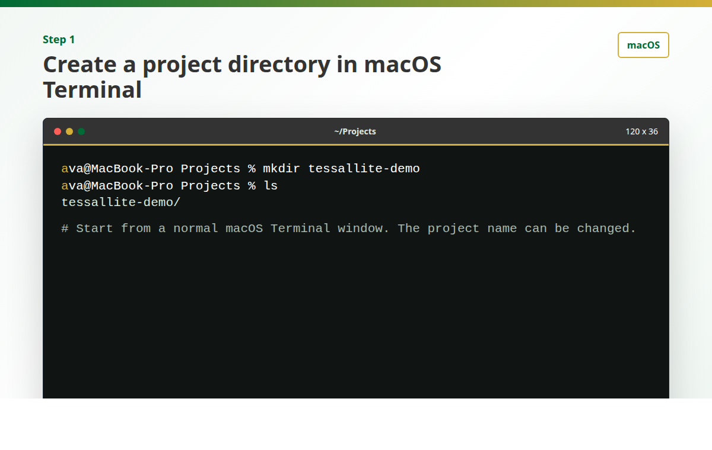

## 2. Change Into The Project Root And Initialize Git

Change into the new project directory before starting the agent. Initialize git
now so every bootstrap file can be reviewed as a normal diff.

```bash
cd tessallite-demo
pwd
git init
```

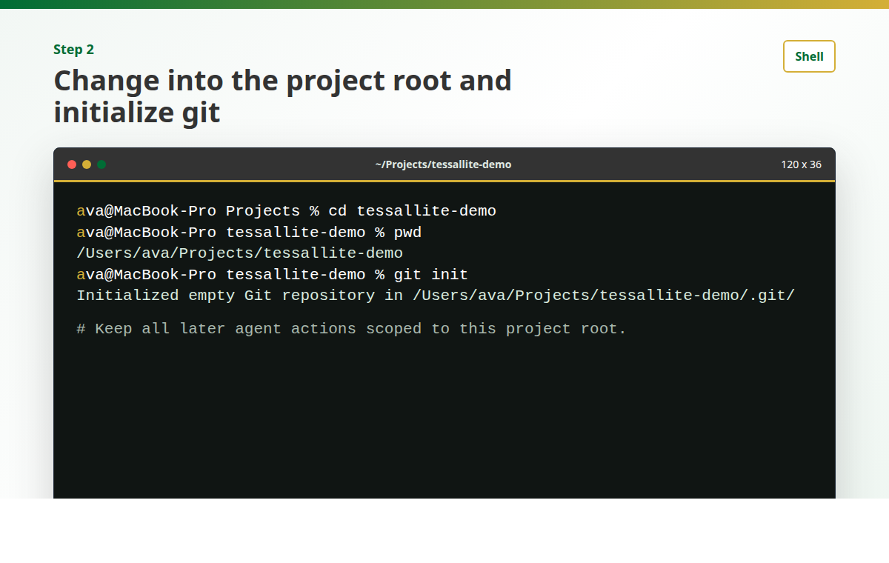

## 3. Copy The Greenfield Prompt Files Into The Project

Before opening Codex, make the two bootstrap files available in the project
root. This avoids trying to run shell copy commands from inside Codex after the
agent has already started.

```bash
KIT=~/Projects/Tessallite-Pattern/docs/tessallite-pattern/prompts
cp "$KIT/agent-memory-instructions.md" .
cp "$KIT/bootstrap-greenfield-project-prompt.md" .
```

Adjust the `~/Projects/Tessallite-Pattern` path if your framework kit checkout
lives somewhere else.

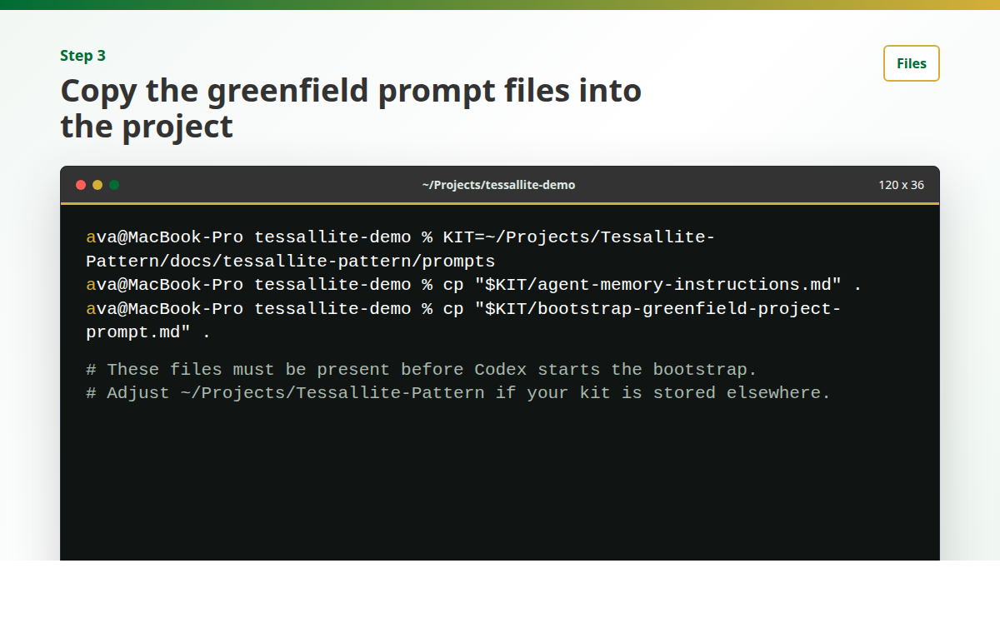

## 4. Verify The Prompt Files Before Opening Codex

Still in macOS Terminal, confirm both prompt files are present. Optionally inspect
the bootstrap prompt header so you know what you are about to ask the agent to
follow.

```bash
ls
sed -n '25,40p' bootstrap-greenfield-project-prompt.md
```

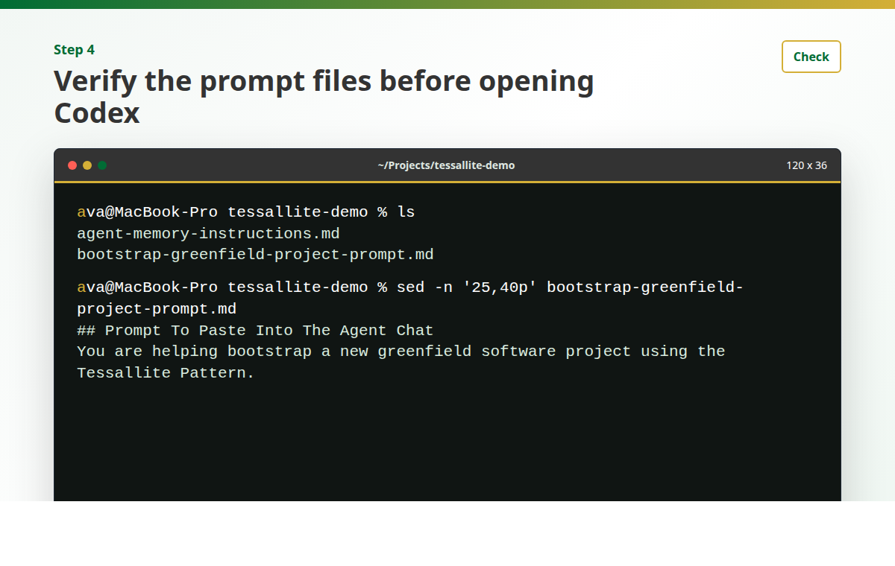

## 5. Open Codex From The Project Root

Now open Codex from inside `/Users/ava/Projects/tessallite-demo`. From this point
on, the terminal is an agent chat session. You should not keep typing normal
shell commands unless the tool explicitly returns you to the shell.

```bash
codex
```

Claude Code alternative:

```bash
claude
```

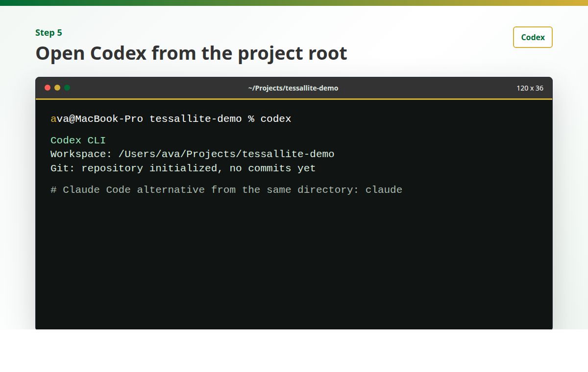

## 6. Tell Codex To Follow The Bootstrap Prompt

There is no shell command named `paste`. In the Codex terminal chat, type a plain
instruction telling the agent to read and follow the local bootstrap prompt.

Use text like this:

```text
Read bootstrap-greenfield-project-prompt.md and follow it exactly.
Read agent-memory-instructions.md when the prompt asks for it.
Install project memory first, create only the bootstrap docs structure,
ask me the initial product questions, and do not write application code.
```

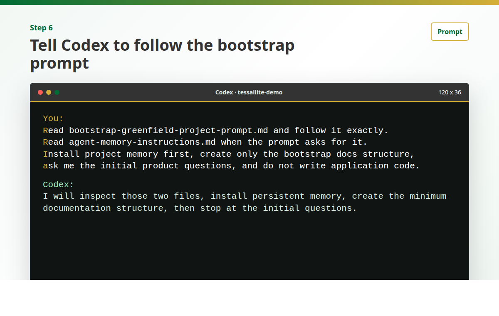

## 7. Codex Installs Persistent Project Memory

The first bootstrap action is project memory. Codex reads
`agent-memory-instructions.md` and creates `AGENTS.md` unless the project already
uses another persistent instruction file.

Expected result:

- `AGENTS.md` exists
- Tessallite Pattern working rules are installed
- future sessions know to optimize for verification, not generation

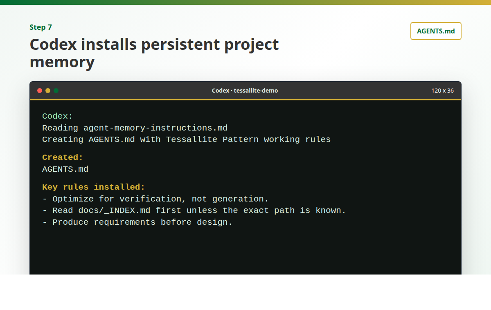

## 8. Codex Creates The Documentation And Log Structure

Codex then creates the minimum L0/L1 documentation routers, working logs,
session folder, and docs index checker.

Expected structure:

```text
docs/_INDEX.md
docs/architecture/_INDEX.md
docs/questions/_INDEX.md
docs/execution/_INDEX.md
docs/guides/_INDEX.md
docs/strategy/_INDEX.md
docs/archive/_INDEX.md
work/logs/project-journal.md
work/sessions/
scripts/check-docs-index.sh
```

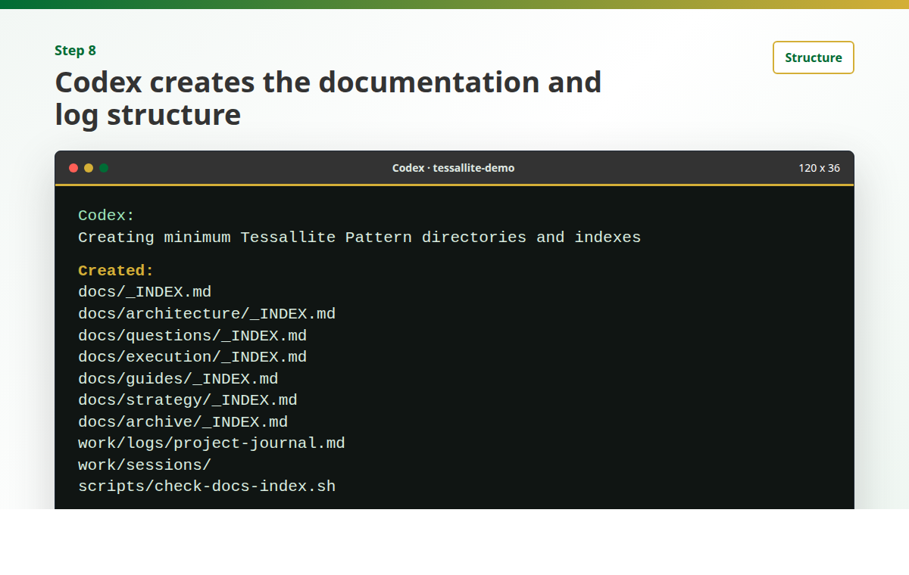

## 9. Codex Creates Starter Project Documents

The greenfield bootstrap creates starter documents and updates the matching
indexes immediately.

Expected starter documents:

```text
docs/architecture/architecture_project-overview.md
docs/questions/questions_initial-project.md
docs/execution/execution_issue-registry.md
docs/guides/guides_developer-guide.md
work/logs/project-journal.md
```

No application source files should be created during this bootstrap step.

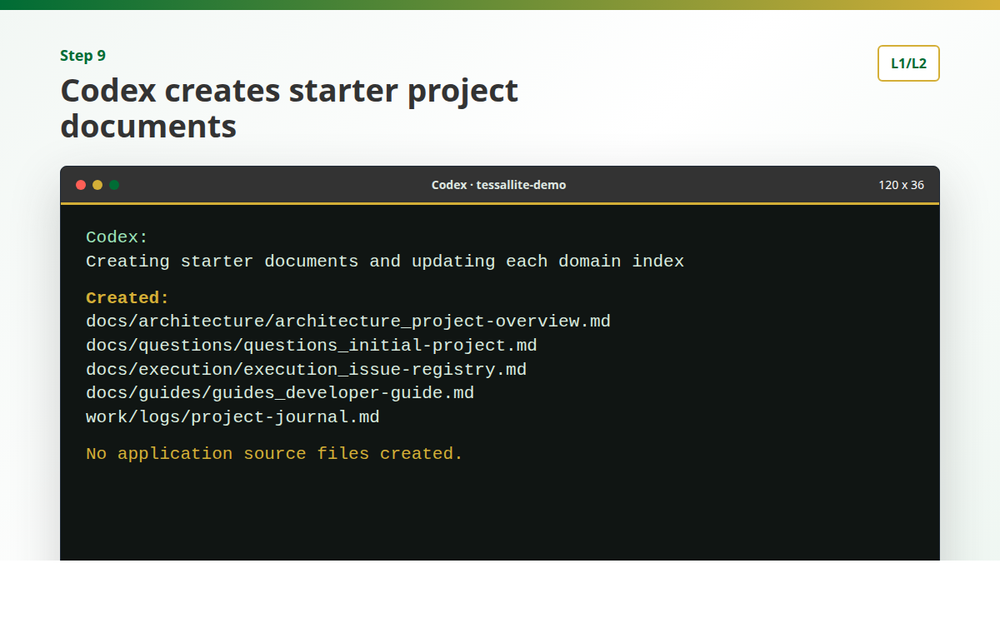

## 10. Codex Asks The Initial Product Questions

After the structure exists, Codex should stop and ask only the minimum initial
product questions. This is the first moment where the human architect supplies
product direction.

Expected questions:

- product goal
- primary users
- core workflows
- target stack
- external systems
- non-goals
- initial delivery milestone

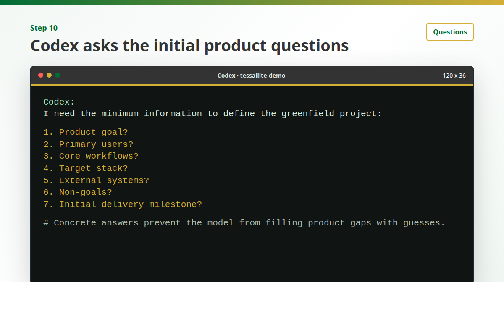

## 11. Answer The Initial Product Questions In Codex

Answer in the Codex chat, not as shell commands. Keep the answers concrete enough
that the agent does not need to invent product behavior.

Example answer:

```text
Product goal: internal task tracker for launch work.
Primary users: project lead, developer, reviewer.
Core workflows: create task, assign owner, review status, close task.
Target stack: TypeScript, SQLite, simple web UI.
External systems: none for the first milestone.
Non-goals: mobile app, SSO, notifications.
Initial milestone: local CRUD workflow with tests and docs.
```

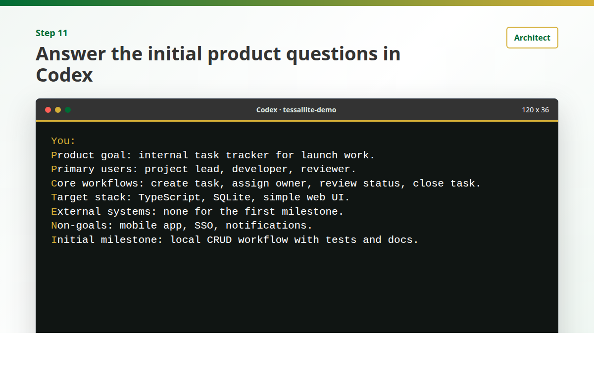

## 12. Codex Records Answers And Stops Before Code

Codex records the answers in the project documents, runs the docs index check,
and stops before writing application code.

Expected result:

- `docs/questions/questions_initial-project.md` updated
- `docs/architecture/architecture_project-overview.md` updated
- `work/logs/project-journal.md` updated
- `scripts/check-docs-index.sh` passes
- no application code exists yet

The next Tessallite Pattern step is to run the requirements authoring prompt,
then the first open-questions gate.

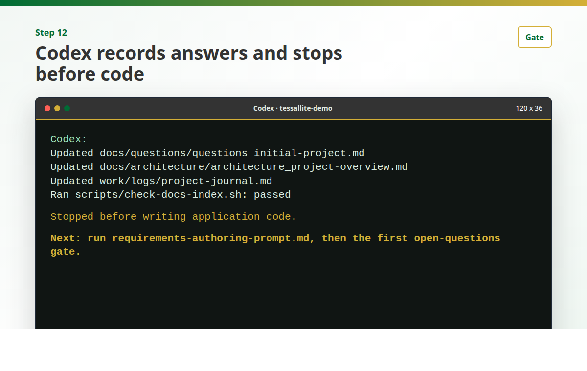

## Result

At the end of this walkthrough, the project has:

- persistent agent memory
- L0/L1 documentation routing
- starter architecture, question, execution, and guide documents
- a project journal
- a docs index checker
- no application code yet

This is the intended greenfield starting point: verification-first structure
before generation begins.
